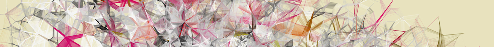

# Digital Media Programming

~

@ Goucher Digital Arts
 Fall Residency, July-August 2016
 Contact: [benjamin.taylor@goucher.edu](mailto:benjamin.taylor@goucher.edu)

~

**Residency**

[Class 1: Intro to p5.js and 2D primitives](/class1)
 [Class 2: Interaction](/class2)
 [Class 3: Interaction II: Mobile](/class3)
 [Class 4: Interaction III: Audio](/class4)

Break

[Class 5: Generative Art](/class5)
 [Class 6: Generative Art II](/class6)
 [Class 7: Generative Art III / Lab](/class7)
 [Class 8: Video Art](/class8)

**Online**

[Week 1: Objects](/week1)
 [Week 2: Final Project draft / Post-Class Resources](/week2)
 [Week 3: Final Project presentations](/week3)
