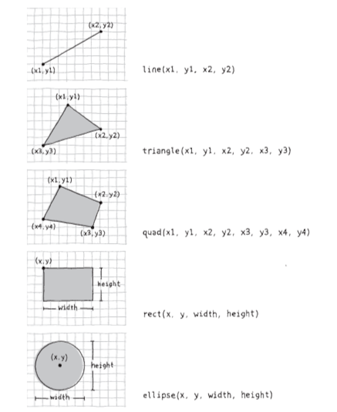

# Intro to p5.js and 2d primitives 

Welcome to the world of creative code!

This residency, you will work with [p5.js](http://p5js.org), a JavaScript toolkit for coding digital art, based on the [Processing](http://processing.org) programming environment. 

P5.js is remarkable because it runs *right in your web browser*. Through p5, you will learn the conventions of JavaScript, one of the core languages of the web.


## Getting Started

You will need a code editor for this class. While many plain-text editors will do, I recommend [Sublime Text](/)


If you are new to programming for the web, I recommend starting with this [p5.js template](/).


## Structure of a Sketch

#### Canvas

Like a painter, a digital artist needs a canvas to draw on. In p5, this is created with the command `createCanvas()`. 

To create a canvas that is 600 pixels wide and 400 pixels tall, use:

```
createCanvas(600,400)
```

#### Setup and Draw

When beginning any sketch, the first code you are likely to write is for the functions `setup` and `draw`. You can read about uses of these functions `here` and `here`

```
// the setup function gets called once when the sketch loads
function setup() {

}

// the draw function gets called 60 times per second.
function draw() {

}
```


## 2D Coordinate Plane

In p5, the drawing canvas is a 2D coordinate plane. This lets you draw and animate shapes with single-pixel accuracy.

The top left point of the canvas is (0,0). 

Distance is measured in pixels on an **x-axis** (moving to the right) and **y-axis** (moving down).


Shapes are drawn using (x,y) coordinates.


## Shapes

#### point
Draw a 1-pixel point at an x/y position.

point( x, y )

```
// One point 
point(10,10);
```


#### line
Draw a line from one x/y position to a second x/y position.

line( x1, y1, x2, y2 )

```
line(10,10,40,20);
```

#### rectangle
Draw a rectangle at an x/y position, with a certain width and height.

rect( x, y, width, height )

```
rect(10,10,100,20);
```

#### ellipse
Draw an ellipse at an x/y position, with a certain horizontal radius and vertical radius.

ellipse( x, y, radius1, radius2 )

```
ellipse(50,50,30,60);
```


#### 2D shapes review

via Fry and Reas




## Fill and Stroke (Colors)

Read about colors in processing [here]().

Transparency

## Putting it together

A beginning sketch might look like this:

```
// the setup function gets called once when the sketch loads
function setup() {
	createCanvas(800,600)
}

// the draw function gets called 60 times per second.
function draw() {
	ellipse(500,300,100,100)
}
```

## Debugging JavaScript


## Interaction preview: mouseX and mouseY


## Reference

Fry & Raes, Ch 3 (Shapes)


## Assignment

- Commit an original sketch to GitHub.
- Complete the Day 1 Exercise on debugging.