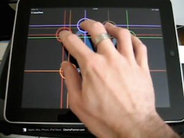

# Interaction II: Mobile




## TL;DR

On multitouch devices, the x and y coordinates of each touch point are stored in an `Array` which can be looped through using a `for` loop.

```
function draw() {
	for ( var i=0; i<touches.length; i++ ) {
		ellipse(touches[i].x, touches[i].y, 80, 80)
	}
}
```


## The `touches` Array

A desktop mouse has two coordinates: `mouseX` and `mouseY`.

On a multitouch device, each touch point will have its own set of x and y coordinates. Given 5 fingers, that means you will have 5 pairs of x and y coordinates.

You might think these would be in variables like *touch1x*, *touch1y*, *touch2x*, etc., but that gets quite verbose. Instead, they are held in an `Array`.

### Arrays

An array is a type of **variable**. It holds a **list of items**.

Example: Let's say we need to remember 100 numbers. **Creating 100 different variables would take a lot of time!** An array can hold all the numbers in one variable.

```
var fibb = [ 1, 1, 2, 3, 5, 8, 13, 21 ]
```
Notice that items in the array are separated by commas, and that there is not a comma after the last item. Arrays are surrounded by square brackes [ ]. 

**Whenever you see square brackets in Javascript, you are most likely looking at an array.**

To create an empty array:

```
var myEmptyArray = []
```

### So, let's talk `touches`

Like `mouseX` and `mouseY`, the `touches` array is created for you by p5. 

`touches[0]` contains the x and y coordinates of the first touch point. (Notice that array indeces start at 0).

To access the x and y of the first touch point, use: `touches[0].x` and `touches[0].y`

```
function draw() {
	if (touches[0]) {
		ellipse(touches[0].x, touches[0].y, 80, 80)
	}
	if (touches[1]) {
		ellipse(touches[1].x, touches[1].y, 80, 80)
	}
	if (touches[2]) {
		ellipse(touches[2].x, touches[2].y, 80, 80)
	}
	if (touches[3]) {
		ellipse(touches[3].x, touches[3].y, 80, 80)
	}
	if (touches[4]) {
		ellipse(touches[4].x, touches[4].y, 80, 80)
	}
}
```

### But wait, there's a better way! A loop.


In the above example, we wrote the same code 5 times -- once for each touch point. 

Loops are perfect for writing repetitive tasks with concise code.


#### creating a loop with `for`

You can use a `for` loop to iterate a chunk of code any number of times.

```
for (var i=0; i<100; i=i+1) {

   // code in here will happen 100 times

}
```

#### what is `i` ?

In the above example, `i` is a variable that counts upward during each iteration. `i` stands for index, but you could use any variable name instead of `i`.

`i` will equal 0 the first time through the loop, then 1, then 2, etc. You can use `i` just as you could use any variable in your code -- to set the location of a circle, or its width, height, etc.

For example, the following code....

```
for (var i=0; i<100; i=i+1) {

   point(i,10);

}
```

..will render as


```
point(0,10);
point(1,10);
point(2,10);
point(3,10);
point(4,10);
point(5,10);
point(6,10);
point(7,10);
point(8,10);
.... and so on until ...
point(99,10)
```

### Looping through `touches`

We can loop through the `touches` array to draw a circle at each touch point. We are starting to accomplish a lot with very little code. That means we're on the right track!

```
function draw() {
	for (var i=0;i<touches.length;i++) {
		ellipse(touches[i].x, touches[i].y, 80, 80)
	}
}
```

Beautiful, isn't it?

## Device Motion

Like `mouseX` and `mouseY`, you can use `rotationX`, `rotationY`, and `rotationZ` to learn a mobile device's current orientation. This can let you make art using gestural device motion. 

I can't say there is a set paradigm for how this is applied. Experiment!

You can read about them [in the reference](http://p5js.org/reference/#/p5/rotationX)


## Reference

Touch interaction: McCarthy, Chapter 5

Loops: McCarthy, Chapter X

Arrays: McCarthy, Chapter X 


## Assignment

- Finish Project 1 (Interactive Study). Be prepared to give a 5-10 minute presentation in which you explain your code to the class.

