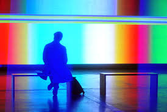

#### Project 2: Generative Artworks

- [Michelle](https://taylorbf.github.io/michelle/GenArt2/)
- [Liz Keiser](https://ekeiser11.github.io/planetGenerator/)
- [Eve](http://evebee.github.io/shootingstars/)
- [Valerie](http://silverroxy79.github.io/Project2-GenerativeArt/)
- [Gisela](https://gisela1014.github.io/P5-In-Class-Samples/generativeArt/)
- [Surmaria](https://sutri001.github.io/My-Work/Project2/)

.

# Video Art & Pixel Processing



## Context
  

[Dan Sandin, 5 minute Romp through the IP (1971)](https://www.youtube.com/watch?v=8qh6jRzjmcY)

[Stephen Beck, Video Weavings (1976)](https://www.youtube.com/watch?v=EjX8aCRQ8Ms)

[Casey Reas, Signal to Noise (2013)](https://vimeo.com/86875572)

## Working with individual pixels

In p5, you have the power to read and write the colors of individual pixels on the canvas.

The method for doing this is to use `loadPixels()`, `pixels[]` and `updatePixels()`. You use two nested `for` loops to loop through each pixel on the canvas and set its value.

```
function draw() {

  // tell the computer we want access to the canvas's pixels
  loadPixels()

    // loop through each (x,y) coordinate in our canvas
    for (var row=0;row<height;row=row+1) {
      for (var col=0;col<width;col=col+1) {
    
        // find the location in the pixels[] array
      	// of the pixel at the current column and row
        var index = (row * width + col) * 4
       
        // set the red, green, blue, and alpha of each pixel
        pixels[index+0] = 255   	// red 
        pixels[index+1] = 0		// green
        pixels[index+2] = 0		// blue
        pixels[index+3] = 255		// alpha
        
      }     
    }  
	
    // update the canvas with our new amazing pixels array!
    updatePixels()
}

```

The above example would set every pixel on the canvas to the color red -- `rgb(255,0,0)`. This is equivalent the `background()` function in p5 -- in fact, this is pretty much how that function is written, under the hood!


## Basic Video In & Out

p5 contains a `createCapture()` function for accessing a computer's video camera.


```
var video

function setup() {
  createCanvas(320,240)
  // define and start video capture
  video = createCapture(VIDEO)
  //resize the video capture
  video.size(320,240)
  // hide the original video stream
  video.hide()
  
}

function draw() {  
  
  // draw current video frame to the canvas as an image
  image(video, 0, 0)
  
}
```

Notice that we are using the `image()` function to draw the video onto the canvas. In our `draw()` function (which happens 60 times per second) we grab the current video frame and draw it to our canvas as an image.

This also means you can do anything to it that we could do with an image, such as resize it, crop it, or move it to a new location on the canvas.

See the **BasicVideo** sketch in this folder to try out this code.

## Video Processing

But wait! Much more can be done to alter the video stream before it is drawn onto the canvas.

### What is a Video, Really?

A video is a series of images. Each image is called one "frame" of the video.

Each frame of a video is *just data*. Specifically, it is a long list of numbers that describe the color of each pixel of the video frame. In p5, this list of numbers is **an array.** This makes sense, because it is a list of related information.

So, just as we were able to edit individual pixels on our canvas, so we can work with individual pixels of our video, using the same methodology.

### Entering the Matrix

Within the `draw()` function, you can use `video.loadPixels()` to access the video's array of pixels.

You can **loop through the array** of pixels and use the color values of individual pixels to draw with.

```

function draw() {
  
  video.loadPixels()
  loadPixels()
  
  // loop through each (x,y) coordinate in our video
  for (var row=0;row<height;row=row+1) {
    for (var col=0;col<width;col=col+1) {
    
      // find the location in the pixels[] array
      // of the pixel at the current column and row
      var index = (row * width + col) * 4
       
      // find the red, blue, and green values of the current pixel 
      var r = video.pixels[index+0]
      var g = video.pixels[index+1]
      var b = video.pixels[index+2]
       
       
       
      // do something cool to CHANGE the r,g,b variables.
      // your code goes here!
      
      
       
      // then set our corresponding canvas pixel with the new r,g,b value
      pixels[index+0] = r       //red
      pixels[index+1] = g       //green
      pixels[index+2] = b       //blue
      pixels[index+3] = 255     //alpha
      
    }
  }
  
  // update the canvas using our new amazing pixels array!
  updatePixels()
}

```

**CAUTION**: Be sure not to confuse `video.pixels[]` and `pixels[]`. 

`video.pixels[]` refers to an array of color values of each pixels in our **current video frame**. 

`pixels[]` refers to an array of color values of each pixels in our **canvas**.


### Ideas for Altering Pixels


##### Make a black and white video

Get each pixel's brightness. If it is less than average, make the pixel black. Otherwise, make the pixel white.


```
var bright = (r + g + b) / 3

if (bright > 127) {
    pixels[index+0] = 255
	pixels[index+1] = 255
	pixels[index+2] = 255
	pixels[index+3] = 255
} else {
	pixels[index+0] = 0
	pixels[index+1] = 0
	pixels[index+2] = 0
	pixels[index+3] = 255
}

```

This code would go where it says `// do something` in the example above. You can also see this code in the **VideoBW** example in this folder.

**Try** 

Adding more "if" conditions to this. 

Making it interactive with the mouse.


##### Pixelate the video or use the color values to draw other shapes

See the `VideoPixels` example in this folder.


## Working with images and static videos 

In class, we looked at using with a live video stream.

However, you can also do pixel manipulation on existing images and videos.

##### Images

You have already learned to create an image

```
var img

function preload() {
	img = loadImage("assets/puppies.jpg")
}
```

You can load the images pixels **in the same way that you worked with a webcam's pixels.**

Rather than create a new example here, I will just say that you will use `img.loadPixels()` and `img.pixels[]` rather than `video.loadPixels()` and `
video.pixels[]`.

##### Existing Video

Similarly, you can load a video with `loadVideo()` rather than using your webcam.

```
var video

function preload() {
	video = loadVideo("assets/puppies.mp4")
}
```

Then you can use `video.loadPixels()` and `video.pixels[]` just as we did with the live webcam stream.


## Assignment

Your final project assignment is a p5 sketch of your own design, on a topic/subject of your own choosing. It is due on the last day of the online portion of the class. This project is wide open and is a chance for you to integrate p5 with your own interests. If you are looking for ideas, you may want to pursue one of the following ideas:

- video art using video processing
- an artwork that connects to your own artistic style
- the creation of a JavaScript Object that moves and/or draws (see [Week 1 online](/week1))
- a new generative artwork or interactive artwork
- another idea!

See the syllabus for a complete project description.

#### IMPORTANT NOTES ABOUT SUBMITTING THE ASSIGNMENT

1) I want to hear from you by email each week with screenshots and a progress update!

2) When you submit this project, please post a video screencapture (i.e. on vimeo/youtube) where you demonstrate your project and explain your code to the class.

	
